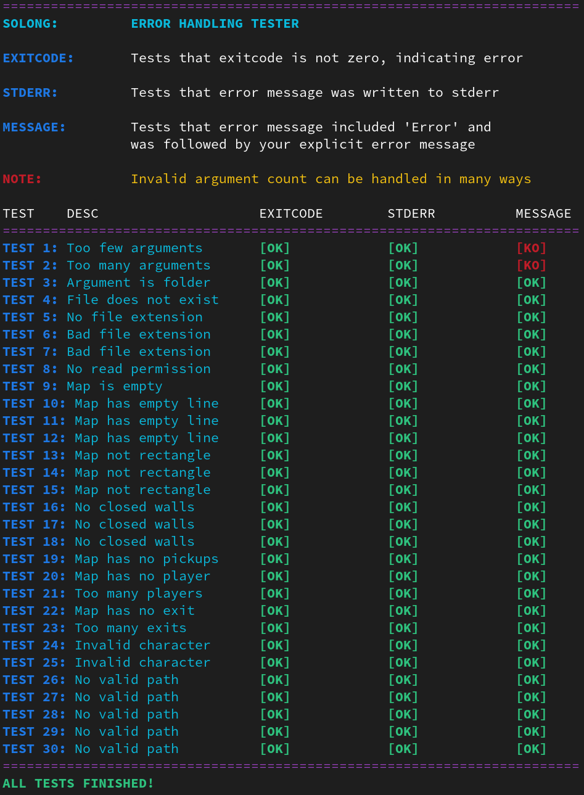

# solong-error-tester

Basic error handling tester for 42 so_long project.

Since tester was designed to check error handling in pre-initialization phase, it is recommended to disable mlx init for testing purposes.

Tests:

- Too few arguments
- Too many arguments
- Argument is folder
- File does not exist
- No file extension
- Bad file extension
- No read permission
- Map is empty
- Map has empty line
- Map is not rectangular
- Map has no closed walls
- Map has no or too many player(s)
- Map has no or too many exit(s)
- Map has no pickup(s)
- Map has invalid characters
- Map has no path to all pickup(s)
- Map has no path to exit

